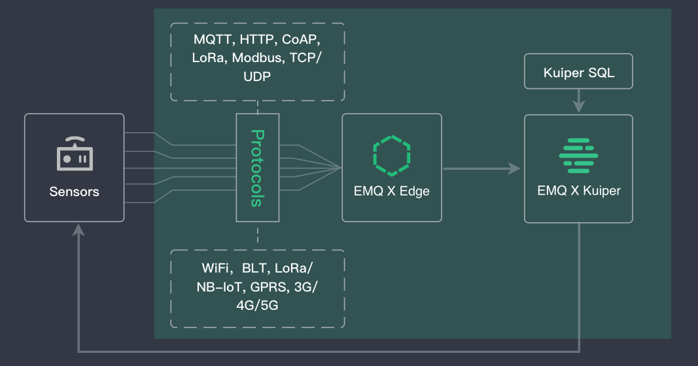
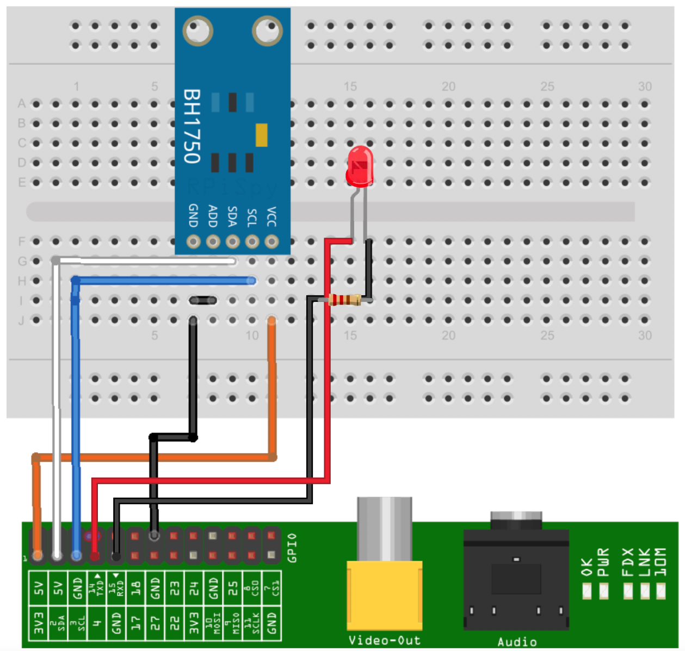
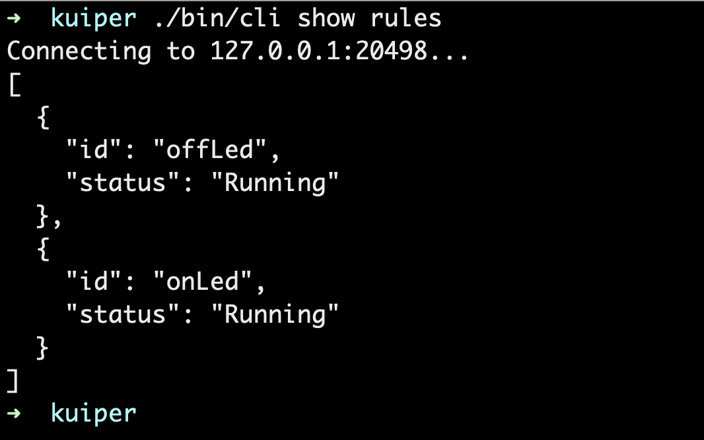
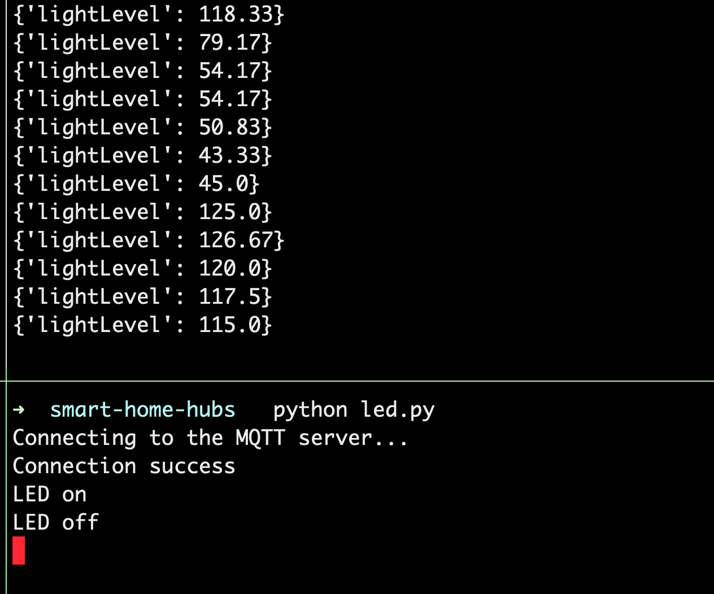

1. # 如何树莓派上搭建智能家庭网关

   随着物联网技术的发展，智能家居系统得到进一步的发展，其利用大量的物联网设备（如温湿度传感器、安防系统、照明系统）实时监控家庭内部状态，随着智能家居设备的越来越多，设备之间的智能联动变的越来越困难，并且由于家庭数据的隐私性用户并不总是愿意将数据上传至云端进行处理，为此我们将尝试利用 **RaspberryPi **+   **EMQ X Edge** + **EMQ X Kuiper** 搭建智能家庭网关，实现智能家居设备数据边缘处理，减少家庭私密数据外流。

   本文中我们将用 BH1750FVI 光照强度传感器采集家庭光照强度数据，利用 EMQ X Kuiper 对光照强度数据分析和处理，实现按照光照强度对 LED 做出相应的控制来验证在树莓派上搭建智能家庭网关可行性。

   

   ## 所需组件

   ### 树莓派 3b+ 以及更高版本

   [树莓派3代B+](<https://www.raspberrypi.org/>) 型是一款基于ARM的微型计算机主板，以SD/MicroSD卡进行存储，该主板提供USB接口和以太网接口，可以连接键盘、鼠标和网线，该主板具备所有PC的基本功能，同时树莓派集成了 Wi-Fi，蓝牙以及大量 GPIO，是智能家庭网关理想选择

   ### EMQ X Edge

   智能家居设备之间通信协议大致有 **MQTT**，**WIFI**，**蓝牙**等，其中 **MQTT 协议** 是基于发布/订阅模式的物联网通信协议，凭借简单易实现、支持 QoS、报文小等特点，为此在本文中我们将使 MQTT 协议作为智能家居设备之间通信协议。由于 RaspberryPi 内存以及处理能力有限，为此我们选在由 [EMQ](<https://emqx.io/>) 开发的 [EMQ X Edge](<https://www.emqx.io/products/edge>) 作为 MQTT broker，EMQ X Edge 是轻量级多协议物联网边缘消息中间件，支持部署在资源受限的物联网边缘硬件。

   ### EMQ X Kuiper

   智能家居设备之间数据传输格式不同，并且数据波动性，为此我们需要对设备上报来的数据做处理。在本文中我们将选择由 [EMQ](<https://emqx.io/>) 开发的  [EMQ X Kuiper](<https://www.emqx.io/products/kuiper>) 对智能家居设备数据边缘化处理，EMQ X Kuiper 基于 SQL 的轻量级边缘流式消息处理引擎，可以运行在资源受限的边缘设备上。通过实时分析家居采集的各类数据，实现对智能家居设备的即时状态管理与控制。

   ### 其他组件：

   - BH1750FVI 光照强度传感器
   -  LED 
   - 330 Ω电阻
   - 面包板, 跳线若干

   

   ## 项目示意图

   

   

   ## 环境搭建

   ### 电路连接

   

   ### 树莓派配置

   我们选择 raspbian 8 作为树莓派操作系统，并选择 python 3 作为项目编程语言

   ```bash
   # 创建 名为 smart-home-hubs 项目目录
   mkdir ~/smart-home-hubs
   ```

   ### EMQ X edge 安装与运行

   ```bash
   $ cd ~/smart-home-hubs
   # 替换 raspbian8 为你系统版本
   $ wget https://www.emqx.io/downloads/edge/v4.1.0/emqx-edge-raspbian8-v4.1.0.zip
   $ unzip emqx-edge-raspbian8-v4.1.0.zip
   $ cd ./emqx
   # 运行 EMQ X edge
   $ ./bin/emqx start
   # output: EMQ X Edge v4.1.0 is started successfully!
   ```

   ### EMQ X Kuiper 安装与运行

   ```bash
   $ cd ~/smart-home-hubs
   # 下载软件包
   $ wget https://github.com/emqx/kuiper/releases/download/0.4.2/kuiper-0.4.2-linux-armv7l.zip
   $ unzip kuiper-0.4.2-linux-armv7l.zip
   $ mv kuiper-0.4.2-linux-armv7l ./kuiper
   $ cd ./kuiper
   # 创建 rules 文件存储规则
   $ mkdir ./rules
   $ ./bin/server
   ```

   

   ## 代码编写

   ### BH1750FVI 光照传感器数据上传

   编写代码读取并计算 BH1750FVI 传感器光照强度数据，并每秒将光照强度数据通过 **MQTT** 协议发布到 **smartHomeHubs/light** 主题上

   ```python
   # gy30.py
   import json
   import time
   
   import smbus
   from paho.mqtt import client as mqtt
   
   
   # BH1750FVI config
   DEVICE = 0x23  # Default device I2C address
   POWER_DOWN = 0x00
   POWER_ON = 0x01
   RESET = 0x07
   CONTINUOUS_LOW_RES_MODE = 0x13
   CONTINUOUS_HIGH_RES_MODE_1 = 0x10
   CONTINUOUS_HIGH_RES_MODE_2 = 0x11
   ONE_TIME_HIGH_RES_MODE_1 = 0x20
   ONE_TIME_HIGH_RES_MODE_2 = 0x21
   ONE_TIME_LOW_RES_MODE = 0x23
   bus = smbus.SMBus(1)
   
   # MQTT Broker config
   broker = '127.0.0.1'
   port = 1883
   topic = 'smartHomeHubs/light'
   
   def read_light():
       data = bus.read_i2c_block_data(DEVICE, ONE_TIME_HIGH_RES_MODE_1)
       light_level = round((data[1] + (256 * data[0])) / 1.2, 2)
       return light_level
   
   
   def connect_mqtt():
       client = mqtt.Client(client_id='light_01')
       client.connect(host=broker, port=port)
       return client
   
   
   def run():
       mqtt_client = connect_mqtt()
       while True:
           light_level = read_light()
           publish_msg = {'lightLevel': light_level}
           mqtt_client.publish(
               topic,
               payload=json.dumps(publish_msg)
           )
           print(publish_msg)
           time.sleep(1)
   
   
   if __name__ == "__main__":
       run()
   
   ```

   ### 配置 EMQ X Kuiper 流处理规则

   我们将在 EMQ X Kuiper 创建名为 `smartHomeHubs` 流，并配置规则对光照强度数据分析，实现对 LED 灯的控制。

   在本文中我们将计算光照强度平均值，并当持续 5 秒平均光照强度大于或小于 55 时开启和关闭LED

   - 创建流

     ```bash
     $ cd ~/smart-home-hubs/kuiper
     
     $ ./bin/cli create stream smartHomeHubs '(lightLevel float) WITH (FORMAT="JSON", DATASOURCE="smartHomeHubs/light")'
     
     SELECT avg(lightLevel) as avg_light from smartHomeHubs where avg_light > 55
     group by TUMBLINGWINDOW(ss, 15);
     
     kuiper > select count(*), avg(humidity) as avg_hum, max(humidity) as max_hum from demo where temperature > 30 group by TUMBLINGWINDOW(ss, 5);
     
     query is submit successfully.
     SELECT avg(lightLevel) as avg_light from smartHomeHubs where lightLevel > 50 group by TUMBLINGWINDOW(ss, 5);
     
     ```

   - 查询流数据

     ```bash
     ./bin/cli query
     > select * from smartHomeHubs
     ```

   - 编写开启 LED 规则(./rules/onLed.rule)

     当持续 5 秒钟平均光照强度小于55时将向 ``smartHomeHubs/led` 主题发送 `"{\"status\": \"on\"}"` 消息，控制 LED 打开

     ```sql
     {
        "sql":"SELECT avg(lightLevel) as avg_light from smartHomeHubs group by TUMBLINGWINDOW(ss, 5) having avg_light < 55;",
        "actions":[
           {
              "mqtt":{
                 "server":"tcp://127.0.0.1:1883",
                 "topic":"smartHomeHubs/led",
                 "sendSingle":true,
                 "dataTemplate": "{\"status\": \"on\"}"
              }
           }
        ]
     }
     ```

   - 编写关闭 LED 规则(./rules/offLed.rule)

     当持续5秒钟平均光照强度大于 55 时将向 ``smartHomeHubs/led` 主题发送 `"{\"status\": \"off\"}"` 消息，控制 LED 关闭

     ```
     {
        "sql":"SELECT avg(lightLevel) as avg_light from smartHomeHubs group by TUMBLINGWINDOW(ss, 5) having avg_light > 55;",
        "actions":[
           {
              "mqtt":{
                 "server":"tcp://127.0.0.1:1883",
                 "topic":"smartHomeHubs/led",
                 "sendSingle":true,
                 "dataTemplate": "{\"status\": \"off\"}"
              }
           }
        ]
     }
     ```

   - 添加规则

     ```bash
     $ ./bin/cli create rule onLed -f ./rules/onLed.rule 
     $ ./bin/cli create rule onLed -f ./rules/offLed.rule 
     ```

   * 查看规则

     ```bash
     $  ./bin/cli show rules
     ```

     

   ### LED 灯控制

   编写代码连接到 EMQ X Edge，并订阅 **smartHomeHubs/led** 主题。监听订阅消息内容，当 status 为 **on** 控制LED 打开，当 status 为 **off** 是控制 LED 关闭

   ```python
   # led.py
   import paho.mqtt.client as mqtt
   import RPi.GPIO as GPIO
   import json
   
   
   # MQTT Broker config
   broker = '127.0.0.1'
   port = 1883
   topic = 'smartHomeHubs/led'
   
   
   def on_connect(client, userdata, flags, rc):
       print("Connecting to the MQTT server...")
       if rc == 0:
           print("Connection success")
       else:
           print("Connected with result code "+str(rc))
       client.subscribe(topic)
   
   
   def on_message(client, userdata, msg):
       payload = json.loads(msg.payload)
       led_status = payload.get('status')
       gpio_status = GPIO.input(4)
       if led_status == 'on' and gpio_status == 0:
           GPIO.output(4, True)
           print('LED on')
       elif led_status == 'off' and gpio_status == 1:
           GPIO.output(4, False)
           print('LED off')
       else:
           pass
   
   
   def run():
       # connect mqtt server
       client = mqtt.Client()
       client.on_connect = on_connect
       client.on_message = on_message
       client.connect(broker, 1883, 60)
       # set raspberryPi GPIO pin
       GPIO.setmode(GPIO.BCM)
       GPIO.setwarnings(False)
       GPIO.setup(4, GPIO.OUT)
       try:
           client.loop_forever()
       except KeyboardInterrupt:
           GPIO.cleanup()
   
   
   if __name__ == "__main__":
       run()
   
   ```

   

   ## 运行测试

   1. `python gy30.py` 获取当前光照数据，并将数据上报到  **smartHomeHubs/light**主题

      

   2. `python led.py` 订阅 **smartHomeHubs/led** 主题，监听LED控制信息

      

   3. 当我们手动降低或升高光照时，可以看到 LED 等开启和关闭 
      

   

   ## 总结

   至此，我们已成功搭建基于  **RaspberryPi **+   **EMQ X Edge** + **EMQ X Kuiper** 智能家庭网关。在本文中我们使用了 RaspberryPi 为网关提供了丰富的外部通信接口，EMQ X Edge 为网关提供了设备之间通信功能，EMQ X Kuiper 为网关提供了设备数据处理以及分析功能。在本文中我们使用光照传感器获取光照强度，通过光照强度来控制 LED 的开和关。在整个过程中所有数据都在本地处理和分析，降低了家庭私密数据的泄漏风险。

   